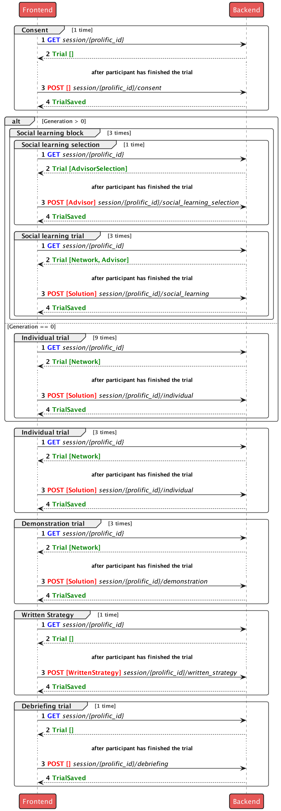

# Reward Network III

## Quick start

### Run the app locally

```bash
docker compose up frontend backend
```

### Run streamlit locally

```bash
docker compose up streamlit
```

### Generate Networks

```bash
docker compose run all python common/generate/generation.py -i data/23_11_13/networks.yml -o data/23_11_13/networks.json
```

```bash
docker compose run all python common/generate/generation.py -i data/23_11_30/networks.yml -o data/23_11_30/networks.json
```

### Generate Solutions

```bash
docker compose run all python common/solve/rule_based.py -c data/23_11_13/solution.yml -n data/23_11_13/networks.json -o data/23_11_13/solution
```

```bash
docker compose run all python common/solve/rule_based.py -c data/23_11_30/solution.yml -n data/23_11_30/networks.json -o data/23_11_30/solution
```

### Train DQN Agent

```bash
docker compose run all python algorithm/dqn/dqn_agent.py --config algorithm/params/seed_0.yml
```

### Apply DQN Agent

```bash
docker compose run all python algorithm/dqn/dqn_exp.py --config algorithm/params/seed_0.yml
```

### Setup Environment for analysis

```bash
python3.10 -m venv .venv
. .venv/bin/activate
pip install --upgrade pip
pip install wheel
pip install -e ".[viz,dev,backend,train]"
```

## Deployments

- Frontend
  URL: [https://rn-iii-frontend.eks-test-default.mpg-chm.com](https://rn-iii-frontend.eks-test-default.mpg-chm.com)
- Backend
  URL:
  [https://rn-iii-backend.eks-test-default.mpg-chm.com](https://rn-iii-backend.eks-test-default.mpg-chm.com)
- Streamlit
  URL:
  [https://rn-iii-te.eks-test-default.mpg-chm.com](https://rn-iii-te.eks-test-default.mpg-chm.com)

## Endpoints

### For participants

https://rn-iii-frontend.eks-test-default.mpg-chm.com/<experiment_type>?PROLIFIC_PID=<prolific_pid>

### Admin panel

https://rn-iii-backend.eks-test-default.mpg-chm.com/progress/<experiment_type>/<tree_idx>

### Links when the docker-compose.yml is running

- React: http://localhost:9000/
- Storybook: http://localhost:6006/
- FastAPI: http://localhost:5000/
- Swagger UI FastAPI: http://localhost:5000/docs

### Run pytest

Run all test

```zsh

docker compose run backend python -m pytest -vv -s

```

### `apiTypes.ts`

`apiTypes.ts` file is generated in the `server.py` each time FastAPI server is
restarted and then copied in frontend `src` folder.

Useful commands to clean up the system:

```bash

docker system df # check disk usage
docker system prune --all --force # clean up unused images and volumes
docker system prune --volumes --force # clean up unused volumes

```

## Backend-Frontend interaction scheme

<p align="centre">

</p>
