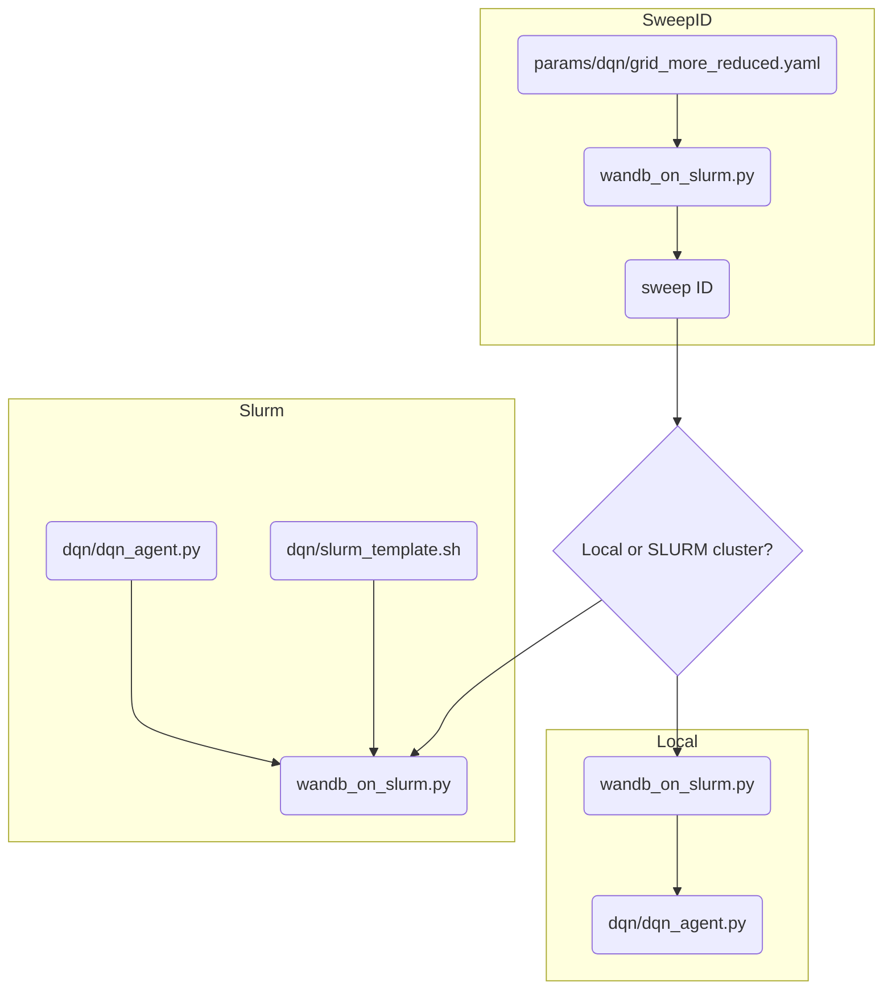

# Reward Network III - Algorithm

## Install required packages

Here Python 3.10.8 was used

```bash
python3 -m venv .venv
. .venv/bin/activate 
pip install --upgrade pip
pip install wheel
pip install -r requirements.txt
```

## Quick start

### Train locally

```bash
python dqn/dqn_agent.py
```

## Repo organization

* **dqn** is the project folder where all python scripts are found. It includes `.py` files used for solving networks through deep reinforcement learning, as well as `.sh`files used to submit dqn runs on cluster
* **params**: includes `.yml` files relevant to each subfolder (generate, solve, dqn)


### DQN + Wandb

Training the DQN model both locally and on cluster is organized in the `wandb_on_slurm.py` script.

First, we create a sweep ID (command `create`) by specifying a parameter grid file: this file contains the path to the script to run (in our case `notebooks/dqn_agent.py`), parameter names and respective values.

```python
python wandb_on_slurm.py create params/dqn/grid.yaml
```

After we get the sweep ID we can:

* run the sweep locally (command `local` followed by sweep ID)

```python
python wandb_on_slurm.py local <sweep_id>
```

* run the sweep on SLURM cluster (command `slurm` followed by sweep ID and the worker in the cluster)

```python
python wandb_on_slurm.py slurm <sweep_id> <number or worker>
```



The script `dqn_agent.py` solves environments all at once using both DQN and rule based methods: the rule based methods results are also logged and serve as reference in the metrics plots.
Note that we specify whether to use Wandb or not at the beginning of the script via the `WANDB_ENABLED` variable.
The `dqn_agent.py` script makes use of the `environment_vect.py` script (where the RN environment class is specified, along with all the methods that provide an observation and take a step in the networks given a list of actions),
`logger.py` (where we keep track of metrics that are sent to wandb + plot functions), `nn.py` (where the RNN model is specified usign Pytorch),
`memory.py` (where we have a memory class to store and retrieve episodes during model training).

We log metrics for each episode: metrics for rule based and for dqn can be then compared in wandb following instructions at https://docs.wandb.ai/ref/app/features/panels/line-plot .

## Model parameters config

The config files are written in `yaml` format and can be found in the `params/dqn` folder. The latest configuration (as of July 2023) is contained
in `grid_single_run.yaml` (for more info on file-based configs in wandb see here: https://docs.wandb.ai/guides/track/config). To run a sweep testing multiple
parameters values see an example of config in `grid_reduced.yaml` or `grid_more_reduced.yaml`.

| Parameter Name         | Type  | Levels                                      |
|------------------------|-------|---------------------------------------------|
| model_type             | str   | ['DQN','RNN']                               |
| observation_type       | str   | ['full','no_level','no_level_loss_counter'] |
| observation_shape      | str   | ['default','concatenated']                  |
| train_data_name        | str   | networks_train.json                         |
| test_data_name         | str   | networks_test.json                          |
| n_episodes             | int   | 20000                                       |
| n_networks             | int   | 1000                                        |
| train_batch_size       | int   | [100,250,500,750]                           |
| n_rounds               | int   | 8                                           |
| n_nodes                | int   | 10                                          |
| learning_rate          | float | 1e-3                                        |
| lr_scheduler_step      | int   | 2000                                        |
| lr_scheduler_gamma     | float | [0.8,0.9]                                   |
| batch_size             | int   | 16                                          |
| nn_hidden_layer_size   | int   | 15                                          |
| memory_size            | int   | 500                                         |
| exploration_rate_decay | float | 0.99                                        |
| nn_update_frequency    | int   | 200                                         |