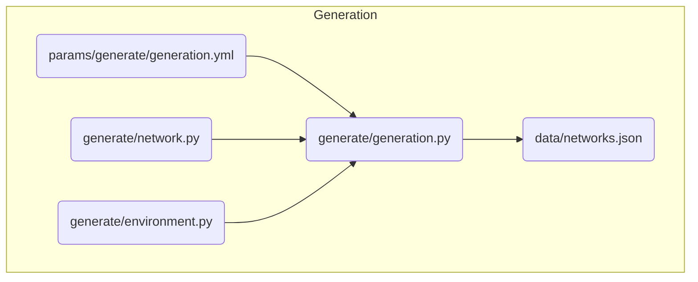
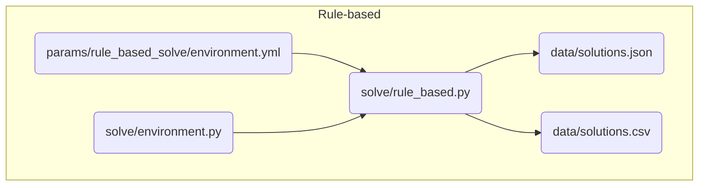

## Workflow

### Network generation

```mermaid

flowchart TD

subgraph Generation
A(params/generate/generation.yml) --> B(generate/generation.py)
W(generate/network.py) --> B(generate/generation.py)
H(generate/environment.py) --> B(generate/generation.py)
B(generate/generation.py) --> C(data/networks.json)
end
```

### Rule-based strategy comparisons

```mermaid

flowchart TD

subgraph Rule-based
A(params/rule_based_solve/environment.yml) --> L(solve/rule_based.py)
G(solve/environment.py) --> L(solve/rule_based.py)
L(solve/rule_based.py) --> B(data/solutions.json)
L(solve/rule_based.py) --> D(data/solutions.csv)
end
```